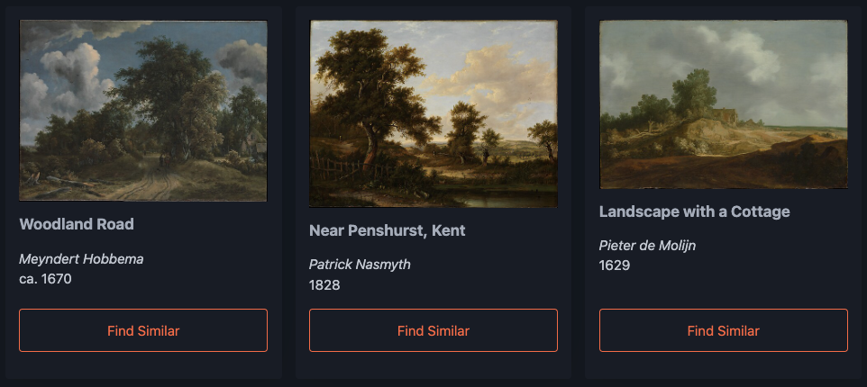

# OnView

OnView is a web application that allows users to discover visually similar paintings from the Metropolitan Museum of Arts collection. The site provides similarity rankings based on the visual characteristics of the paintings using embeddings generated from the OpenAIs CLIP model. Each of the 2000+ paintings is currently on display at the MET and is available under Creative Commons Zero through the museum's Open Access Initiative.

You can visit the OnView site [here](https://onview.ralphdelia1.workers.dev/), and learn more about the project on my [personal website](https://ralphdelia.github.io/pages/index.html#onview).

## How It Works

Uses embeddings from OpenAI's CLIP model to represent visual features. Compares artwork embeddings to find visual similarities. Powered by Cloudflare technologies: Workers, Hono, D1, and Vectorize.
